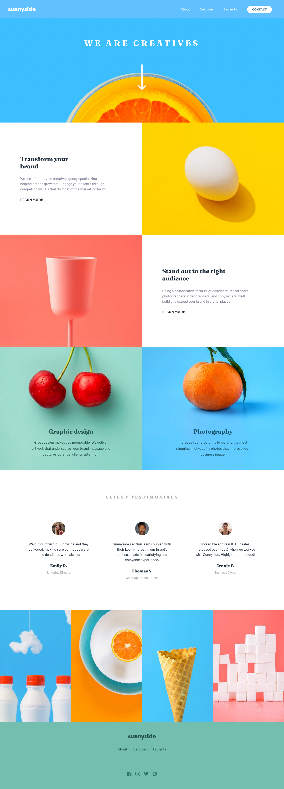

# Frontend Mentor - Sunnyside agency landing page solution

This is a solution to the [Sunnyside agency landing page challenge on Frontend Mentor](https://www.frontendmentor.io/challenges/sunnyside-agency-landing-page-7yVs3B6ef). Frontend Mentor challenges help you improve your coding skills by building realistic projects.

## Overview

### Screenshot

### Links

- Solution URL: [solution URL](https://github.com/A-n-i-e/Sunnyside-agency-landing-page-solution)
- Live Site URL: [live site URL](https://a-n-i-e.github.io/Sunnyside-agency-landing-page-solution/)

## My process

### Built with

- Semantic HTML5 markup
- CSS custom properties
- Flexbox
- CSS Grid

### Useful resources

- [Glassmorphism](https://css.glass/) 

## Author

- Frontend Mentor - [@A-n-i-e](https://www.frontendmentor.io/profile/A-n-i-e)

#Trust in God!
